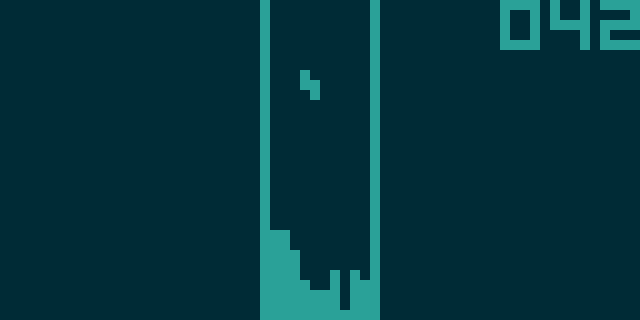
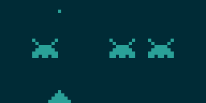
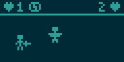

======
octemu
======

Octane's CHIP-8 Emulator: A safe and efficient CHIP-8/SUPER-CHIP emulator (interpreter)
written in C and SDL3.

Build
=====

Requirements: SDL3 (libsdl3-dev)::

    make octemu

Usage
=====

Start the emulator with a ROM file::

    ./octemu ./rom.ch8

Adjust execution frequency with the ``-f`` option::

    ./octemu -f 500 ./rom.ch8

Modes
-----

By default octemu uses Octo's quirks ("octo mode") for compatibility with modern ROMs.
To run ROMs that need original SUPER-CHIP 1.1 or CHIP-8 quirks, set ``-m`` option::

    ./octemu -m schip ./rom.ch8
    ./octemu -m chip8 ./rom.ch8

This only affects quirks behaviors. It does not prevent ROMs from using SUPER-CHIP
instructions.

Keypad mapping
--------------

+-------+-------+-------+-------+
| 1 (1) | 2 (2) | 3 (3) | C (4) |
+-------+-------+-------+-------+
| 4 (Q) | 5 (W) | 6 (E) | D (R) |
+-------+-------+-------+-------+
| 7 (A) | 8 (S) | 9 (D) | E (F) |
+-------+-------+-------+-------+
| A (Z) | 0 (X) | B (C) | F (V) |
+-------+-------+-------+-------+

* ``Space``: Pause/Resume
* ``Esc``: Quit
* ``F5``: Reset the emulator and reload ROM
* ``F12``: Save BMP screenshot to current directory

Screenshots
===========

Tetoris (chip8 mode):

Space Invaders (schip mode):

`Horsey Jump <https://johnearnest.github.io/chip8Archive/play.html?p=horseyJump>`__
(octo mode):

.. image:: img/horseyjump.png
    :alt: octemu running horseyJump.ch8 in octo mode

`Knight <https://johnearnest.github.io/chip8Archive/play.html?p=knight>`__
(octo mode):

`Black Rainbow <https://johnearnest.github.io/chip8Archive/play.html?p=blackrainbow>`__
(octo mode):

